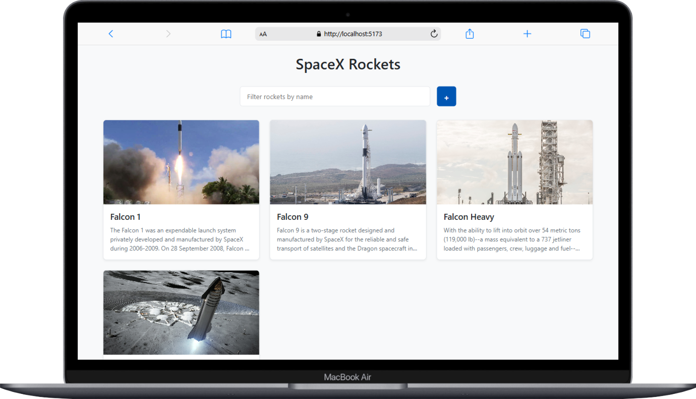
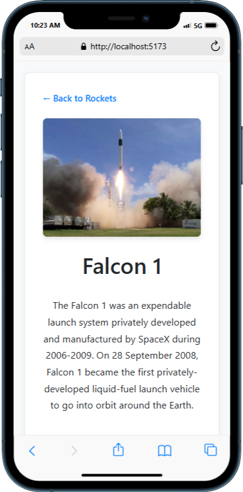

# 🚀 Allo Bank Frontend Technical Assignment

This project is a submission for the **Frontend Developer** technical test at **PT Allo Bank Indonesia, Tbk**.

## 📄 Project Description

This application displays a list of rockets fetched from the SpaceX API and allows users to:

- View a list of rockets
- Filter rockets by name
- Add a new rocket locally
- View detailed information of a selected rocket

## 🛠️ Technologies Used

- [Vue 3](https://vuejs.org/)
- [Vite](https://vitejs.dev/)
- [Vue Router Auto](https://github.com/posva/unplugin-vue-router)
- [SpaceX API](https://github.com/r-spacex/SpaceX-API)

## 📦 Key Features

### ✅ Rocket List Page (`/`)
- Displays list of rockets (image, name, and description)
- Includes a search input to filter rockets by name
- Includes a form to add a new rocket (locally)
- Implements UI states: loading, error, and success

### ✅ Rocket Detail Page (`/rockets/:id`)
- Displays detailed information of a rocket based on its ID
- Includes: image, name, description, cost per launch, country, and first flight date

## 📷 App Screenshots

### Rocket List Page


### Rocket Detail Page


> *Note: The screenshots above are the result of the completed test. You can find them in the `/screenshots` folder.*

## 🚀 How to Run

```bash
# 1. Clone the repository
git clone https://github.com/muelava/allo-fe-test.git
cd allo-frontend-test

# 2. Install dependencies
npm install

# 3. Start development server
npm run dev
```

🙏 Thank You
Thank you for the opportunity to complete this technical test. If you have any questions or need further clarification, feel free to reach out to me.
